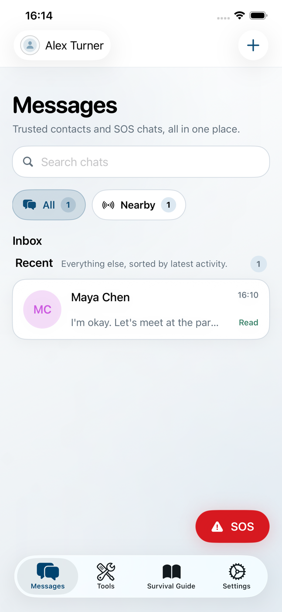
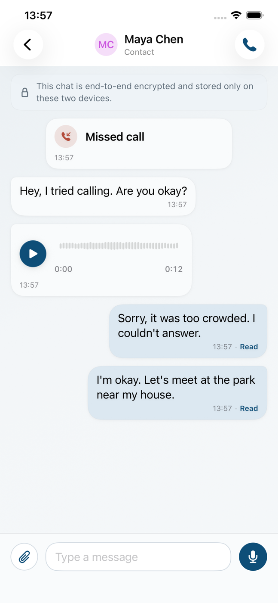
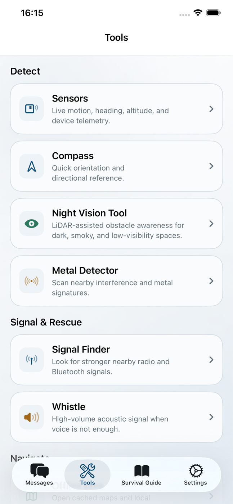
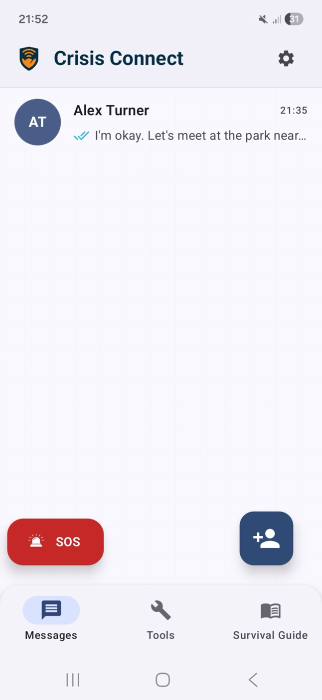
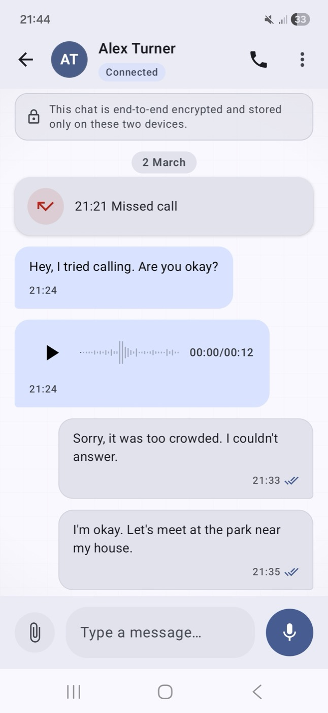
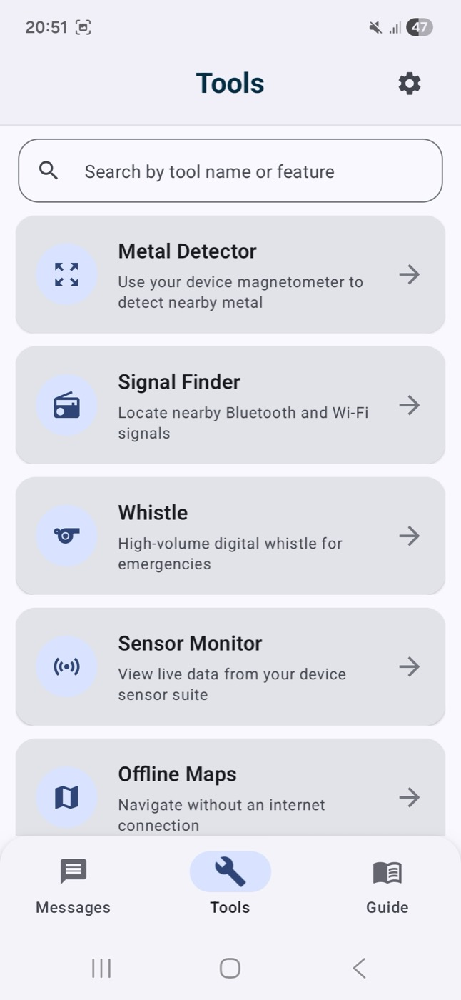

<p align="center">
  
</p>

<h1 align="center">Crisis Connect</h1>

<p align="center">
  <strong>When networks fail, we connect.</strong><br/><br/>
  Open-source, offline-first communication platform for disaster response.<br/>
  End-to-end encrypted messaging, voice and video calls, and rescue coordination.<br/>
  The Bluetooth layer needs no infrastructure at all. When a network is reachable,<br/>
  an end-to-end encrypted internet layer extends the same conversation.
</p>

<br/>

<p align="center">
  <a href="https://play.google.com/store/apps/details?id=com.auralis.crisisconnect"></a>&nbsp;&nbsp;
  <a href="https://apps.apple.com/app/crisis-connect/id6759731195"></a>&nbsp;&nbsp;
  <a href="https://crisisconnect.network"></a>
</p>

<p align="center">
  <a href="./LICENSE"></a>&nbsp;
  &nbsp;
  &nbsp;
  &nbsp;
  &nbsp;
  &nbsp;
  
</p>

<p align="center">
  <a href="https://x.com/CrisisConnectHQ"></a>&nbsp;
  <a href="https://www.instagram.com/crisisconnecthq/"></a>&nbsp;
  <a href="https://www.linkedin.com/company/112030175"></a>&nbsp;
  <a href="https://crisisconnect.com.tr"></a>
</p>

<p align="center">
  <a href="#the-problem">Problem</a>&nbsp;&nbsp;&bull;&nbsp;&nbsp;
  <a href="#how-it-works">How It Works</a>&nbsp;&nbsp;&bull;&nbsp;&nbsp;
  <a href="#features">Features</a>&nbsp;&nbsp;&bull;&nbsp;&nbsp;
  <a href="#security-model">Security</a>&nbsp;&nbsp;&bull;&nbsp;&nbsp;
  <a href="#architecture">Architecture</a>&nbsp;&nbsp;&bull;&nbsp;&nbsp;
  <a href="#getting-started">Build From Source</a>&nbsp;&nbsp;&bull;&nbsp;&nbsp;
  <a href="#contributing">Contribute</a>
</p>

---

## Table of Contents

- [The Problem](#the-problem)
- [How It Works](#how-it-works)
- [Screenshots](#screenshots)
- [Features](#features)
  - [Offline Communication](#offline-communication)
  - [Internet Layer](#internet-layer)
  - [Crisis Sentinel](#crisis-sentinel)
  - [Rescue Operations](#rescue-operations)
  - [Emergency Toolkit](#emergency-toolkit)
  - [Home Screen & System Integration](#home-screen--system-integration)
- [Security Model](#security-model)
  - [Bluetooth Layer Encryption](#bluetooth-layer-encryption)
  - [Internet Layer Encryption](#internet-layer-encryption)
  - [Pairing & Key Exchange](#pairing--key-exchange)
  - [Identity & Certificates](#identity--certificates)
  - [Data Storage](#data-storage)
  - [API Protection](#api-protection)
  - [What Is *Not* End-to-End Encrypted](#what-is-not-end-to-end-encrypted)
- [Architecture](#architecture)
  - [Repository Structure](#repository-structure)
  - [Tech Stack](#tech-stack)
  - [Communication Protocol](#communication-protocol)
  - [Mesh Networking](#mesh-networking)
  - [Voice Pipeline](#voice-pipeline)
  - [Backend Services](#backend-services)
  - [Build Variants](#build-variants)
- [Getting Started](#getting-started)
  - [Download the App](#download-the-app)
  - [Build From Source](#build-from-source)
- [Codebase](#codebase)
- [Testing](#testing)
- [Privacy](#privacy)
- [Permissions](#permissions)
- [Localization](#localization)
- [Contributing](#contributing)
- [Security Policy](#security-policy)
- [Roadmap](#roadmap)
- [Links](#links)
- [License](#license)

---

## The Problem

When disaster strikes, communication infrastructure is the first thing to fail. Cell towers collapse. Power grids go offline. Internet becomes unreachable. The very tools people depend on for coordination -- messaging apps, phone calls, maps -- stop working at the exact moment they are needed most.

This is not a hypothetical scenario. After the 2023 earthquakes in Turkey and Syria, cellular networks were down for days across entire provinces. During Hurricane Maria in Puerto Rico, 95% of cell sites were knocked out. In the 2011 Japan earthquake and tsunami, millions lost all connectivity.

Every major disaster exposes the same gap: **there is no widely available communication tool designed to keep working when infrastructure does not.**

Existing solutions either require specialized radio hardware (walkie-talkies, satellite phones) that most people don't carry, or depend on mesh networking protocols that still assume some form of internet backhaul.

Crisis Connect was built to close that gap. A communication tool that runs on the phone already in your pocket, works over Bluetooth with zero infrastructure dependency, and encrypts everything end-to-end by default.

## How It Works

Crisis Connect is **offline-first**: the Bluetooth stack is the foundation, and everything else is layered on top of it. Devices talk directly to each other using the Bluetooth hardware already present in every modern smartphone -- no cell tower, no router, no server.

```
     ┌──────────┐         ┌──────────┐         ┌──────────┐
     │ Device A │◄──BLE──►│ Device B │◄──BLE──►│ Device C │
     └──────────┘         └──────────┘         └──────────┘
          │                     │                     │
          │   QR Key Exchange   │   GATT Mesh Relay   │
          │   ECDH + AES-256    │   Multi-hop Forward │
          │                     │                     │
          ▼                     ▼                     ▼
     ┌─────────────────────────────────────────────────────┐
     │              All messages E2E encrypted             │
     │         Stored only on sender & receiver            │
     │            No server ever sees plaintext            │
     └─────────────────────────────────────────────────────┘
```

The offline stack operates across three layers:

1. **Discovery** -- BLE advertising and scanning find nearby devices automatically. No pairing menu, no Bluetooth settings. The app handles everything.

2. **Secure Channel** -- Before any communication, devices exchange cryptographic keys through QR code scanning or a SPAKE2 short-code pairing session. This creates a verified, encrypted channel between two specific devices.

3. **Communication** -- Messages, voice, images, and files flow through this encrypted channel. If the recipient is not in direct range, the GATT mesh protocol relays data through intermediate devices -- each hop maintaining end-to-end encryption.

**When a network is reachable**, the same contacts, the same conversations and the same identity carry over to an internet transport that is also end-to-end encrypted -- using the Signal Protocol -- and that adds long-range voice and video calls, attachments and push notifications. The two transports are interchangeable per contact: a chat that started over Bluetooth continues over the internet and vice versa, and messages queue and drain on whichever link comes back first.

Neither layer depends on the other. The app is fully functional in airplane mode with Bluetooth enabled.

## Screenshots

### iOS

<p align="center">
  &nbsp;&nbsp;&nbsp;
  &nbsp;&nbsp;&nbsp;
  
</p>

### Android

<p align="center">
  &nbsp;&nbsp;&nbsp;
  &nbsp;&nbsp;&nbsp;
  
</p>

<p align="center">
  <sub><strong>Left:</strong> Message inbox with trusted contacts and SOS broadcast&nbsp;&nbsp;&bull;&nbsp;&nbsp;<strong>Center:</strong> E2E encrypted chat with voice messages, calls, and read receipts&nbsp;&nbsp;&bull;&nbsp;&nbsp;<strong>Right:</strong> Built-in emergency tools for disaster scenarios</sub>
</p>

## Features

### Offline Communication

Everything in this table works with **zero internet connectivity**. Messages are stored locally on-device and never pass through any server.

| Feature | Description | Transport |
|:--|:--|:--|
| **Text Messaging** | End-to-end encrypted text messages with read receipts and timestamps | BLE GATT / RFCOMM |
| **Voice Calls** | Real-time Opus-encoded voice calls, working cross-platform between Android and iOS | GATT audio link (0xCD00) / RFCOMM |
| **Voice Messages** | Record, send, and play back voice messages with waveform visualization | BLE GATT (chunked) |
| **Image Transfer** | Send photos with automatic compression, chunked transfer, and progress tracking | BLE GATT (chunked) |
| **File Transfer** | Share documents, offline map bundles and files with delivery receipts | BLE GATT (chunked) |
| **Mesh Relay** | Messages hop through intermediate devices when sender and receiver aren't in direct range | GATT mesh protocol |
| **QR Pairing** | Scan a QR code to add a contact and establish an encrypted channel | Camera + ECDH |
| **Nearby Pairing** | Add a nearby contact by short code without exposing a harvestable identifier | SPAKE2 (RFC 9382) over BLE |
| **SOS Broadcast** | Emergency broadcast visible to all nearby devices running Crisis Connect, surviving a background kill | BLE advertising |
| **Agency Bridge** | Field responders relay agency channel messages, media and calls to nearby offline devices | BLE bridge |

### Internet Layer

When connectivity exists, Crisis Connect adds a second transport. It is end-to-end encrypted with the Signal Protocol and carries the same conversations as the Bluetooth layer.

| Feature | Description |
|:--|:--|
| **E2E Internet Messaging** | Signal Protocol sessions (libsignal, PQXDH) with forward secrecy, per-message ratcheting and anti-downgrade pinning |
| **Voice & Video Calls** | 1:1 WebRTC calls with native call UI (CallKit on iOS, Telecom on Android), lock-screen ringing and PushKit/FCM wake-up |
| **Screen Sharing** | Full-device screen share during a call, via a ReplayKit broadcast extension on iOS |
| **Attachments** | Encrypted images, documents and voice notes, byte-compatible across Android, iOS and the web dashboard |
| **Contact Discovery** | Opt-in, phone-number-based discovery gated behind phone verification, with safety numbers and TOFU identity-change warnings |
| **Agency Channels** | Responder-to-agency and cross-agency ("hierarchy") conversations with roles, receipts and deep-linked notifications |
| **Store & Forward** | Undelivered messages queue on-device and drain automatically when either transport comes back |

### Crisis Sentinel

An in-app assistant for disaster scenarios, built to work without a network:

- **Offline engine** -- an on-device language model, executed through Google AI Edge LiteRT-LM, with a downloadable model manifest so the model is fetched once while online and used thereafter with no connection.
- **Online engine** -- an optional cloud engine with a provider/model picker, tool cards, and chat sync with the Crisis Connect web dashboard.
- **Disaster grounding** -- an offline knowledge index, incident extraction from conversation, safety-coverage checks and output validation, with tool results rendered on the offline map.

### Rescue Operations

Crisis Connect includes a dedicated rescue module designed for emergency response teams (AFAD, Red Cross, field teams):

- **Role-Based Access Control** -- Rescue team members are assigned `admin` or `fieldteam` roles through Firebase custom claims. Roles are cryptographically verified even when offline through ECDSA-signed role certificates.

- **Role Certificates** -- When a rescue device is online, it requests a signed certificate from Firebase Cloud Functions. This certificate (ECDSA P-256, 72-hour TTL) can be verified by any other device offline, proving the holder's rescue team identity without needing to contact a server. Certificates renew in the background and are checked against a server-side revocation list when online.

- **Victim ↔ Field Team Link** -- Live rescuer-to-victim voice calls, medical information hand-off, a remote signal feed and sightings that survive going offline.

- **Live Location Sharing** -- Rescue devices share real-time GPS coordinates during active operations, with configurable update intervals and battery-aware policies.

- **CrisisLink Sync** -- A background sync engine that maintains rescue session state across all team devices, handling merge conflicts and offline queue reconciliation.

- **Agency Routing** -- Firestore security rules scope data access by agency, ensuring that different rescue organizations see only their own operational data.

- **Dynamic Feature Module** -- On Android, rescue features are delivered as a dynamic feature module through Play Feature Delivery, keeping the base app lightweight for civilian users.

### Emergency Toolkit

Beyond communication, the app includes tools designed for disaster scenarios:

| Tool | Description | Platform |
|:--|:--|:--|
| **Offline Maps** | Download map regions for offline use. Navigate without internet using MapLibre vector tiles. | Android + iOS |
| **Compass** | Sensor-fused directional compass with heading, pitch, and roll readings. | Android + iOS |
| **Signal Finder** | Scans for cellular, Wi-Fi, and Bluetooth signals in the area. Helps locate zones with potential connectivity. | Android + iOS |
| **Metal Detector** | Uses the device magnetometer to detect metallic objects. Visual and audio feedback with adjustable sensitivity. | Android + iOS |
| **Emergency Whistle** | High-volume acoustic signals with Siren Sweep and Rescue modes at configurable frequencies. | Android + iOS |
| **Sensor Dashboard** | Real-time readouts from all device sensors: accelerometer, gyroscope, magnetometer, barometer, ambient light. | Android + iOS |
| **Survival Guide** | Step-by-step emergency checklists for earthquakes, floods, fires, and other scenarios. Available offline. | Android + iOS |
| **LiDAR Scanner** | Uses LiDAR depth sensor for obstacle awareness in dark, smoky, or low-visibility environments. | iOS (LiDAR devices) |
| **Night Vision** | Camera-assisted obstacle detection for low-light conditions using LiDAR point cloud. | iOS (LiDAR devices) |

### Home Screen & System Integration

Reaching SOS should never require unlocking the phone and hunting for an app icon.

| Integration | Android | iOS |
|:--|:--|:--|
| **SOS widget** | Home-screen widget with live SOS status | WidgetKit SOS widget |
| **Recent disasters widget** | Home-screen widget with a background refresh worker | WidgetKit widget |
| **One-tap SOS** | Quick Settings tile -- from the shade straight into the SOS countdown | iOS 18 Control Center control, lock screen, Action Button |
| **Live status** | Ongoing notification during an active broadcast | SOS Live Activity |

SOS arms with a 5-second countdown before it broadcasts, so an accidental tap does not declare an emergency.

## Security Model

Security is not a feature layer added on top -- it is foundational to the architecture. Every design decision assumes an adversarial environment where devices may be compromised, networks may be monitored, and identities may be spoofed.

### Bluetooth Layer Encryption

All offline messages are encrypted with **AES-256-GCM** before leaving the sending device. The key is derived from the ECDH shared secret established during pairing.

| Platform | Encryption Library | Algorithm |
|:--|:--|:--|
| Android | [Google Tink](https://github.com/tink-crypto/tink-java) | AES-256-GCM |
| iOS | Apple CryptoKit | AES-256-GCM |

Messages are encrypted **before** entering the BLE transport layer. Even if Bluetooth traffic is intercepted, the attacker sees only ciphertext. The GATT mesh relay nodes forward encrypted payloads without being able to read them.

### Internet Layer Encryption

Internet messaging runs the **Signal Protocol** through [libsignal](https://github.com/signalapp/libsignal) -- the same library Signal ships -- on both platforms:

- **PQXDH** session establishment with a server-hosted prekey pool
- **Double Ratchet** forward secrecy: every message advances the chain, and a message key is one-time
- **Static-static ECDH sender authentication** binds a received conversation to the authenticated sender
- **Anti-downgrade pin**: once a Signal session exists with a peer, an older-format message from that peer is dropped fail-closed
- **Hardware-backed identity key** (Android Keystore `AGREE_KEY` / iOS Keychain)
- **TOFU warning** when a contact's identity key changes, with safety numbers for out-of-band verification

The relay server stores only ciphertext, and expired envelopes are purged server-side.

### Pairing & Key Exchange

Two offline paths establish a verified channel:

**QR pairing** uses **Elliptic-Curve Diffie-Hellman (ECDH)** over the **P-256 curve**:

1. Device A generates a key pair
2. Device A encodes its public key into a QR code
3. Device B scans the QR code and generates its own key pair
4. Both devices compute the shared secret using ECDH
5. The shared secret is passed through **HKDF-SHA256** to derive the AES-256 session key
6. A relay-borne identity announce makes the pairing bidirectional, so both sides end up with a usable internet identity too

**Nearby pairing** uses **SPAKE2 (RFC 9382)** over P-256: a password-authenticated key exchange driven by a short code, so a device never advertises a harvestable phone number or identifier in order to be addable.

Both happen entirely offline. No certificate authority, no key server, no internet connection.

### Identity & Certificates

For rescue team identity verification, Crisis Connect uses a custom certificate chain:

```
Firebase Cloud Functions (trusted signer)
        │
        │── Signs certificate with ECDSA P-256
        │   using server-held private key
        │
        ▼
┌─────────────────────────────────────────┐
│           Role Certificate              │
├─────────────────────────────────────────┤
│  Owner UID                              │
│  Role (admin / fieldteam)               │
│  Public Key (Base64)                    │
│  Issued At (timestamp)                  │
│  Expires At (issued + 72 hours)         │
│  ECDSA Signature (DER-encoded)          │
│  Algorithm: SHA256withECDSA             │
│  Curve: P-256                           │
└─────────────────────────────────────────┘
```

Any device can verify a role certificate offline using the embedded public key of the signing authority. This allows rescue teams to prove their identity to civilian devices without internet connectivity. Issuance is gated behind platform attestation (Play Integrity on Android, App Attest on iOS).

### Data Storage

| Data | Android | iOS |
|:--|:--|:--|
| Messages | SQLCipher encrypted Room database | Keychain-backed local storage |
| Signal sessions | Room, inside the SQLCipher database | Keychain-backed store |
| Credentials | Android Keystore (hardware-backed) | iOS Keychain (Secure Enclave) |
| Preferences | EncryptedSharedPreferences | Keychain-backed preferences |
| Media blobs | Encrypted on-device cache for offline viewing | Encrypted on-device cache |

P2P messages are stored **only on the two communicating devices**. Internet messages transit the relay as ciphertext and are deleted after delivery. Deleting the app removes all local messages and keys permanently.

### API Protection

When internet is available, all Firebase API calls are protected by:

- **Firebase App Check** with platform-native attestation:
  - Android: [Play Integrity API](https://developer.android.com/google/play/integrity)
  - iOS: [App Attest](https://developer.apple.com/documentation/devicecheck/establishing-your-app-s-integrity)
- **Firebase Authentication** (Google Sign-In, phone verification, optional enterprise SSO)
- **Firestore Security Rules** -- server-side access control enforcing per-document permissions based on user roles, agency membership, and document ownership

### What Is *Not* End-to-End Encrypted

Being explicit about the boundaries matters more than a marketing claim:

- **1:1 internet calls** are encrypted in transit with **DTLS-SRTP** (standard WebRTC). They are not additionally end-to-end encrypted above the media layer, and they traverse a TURN relay when a direct path is unavailable.
- **SOS reports sent to an agency dashboard** are transport-encrypted, not end-to-end encrypted -- the receiving agency is, by design, able to read them.
- **Group calls over an SFU with MLS per-frame encryption** exist in this repository as an experimental, unshipped backend. They are **not enabled in the released apps**. See [Roadmap](#roadmap).
- **Crash reporting and analytics** report app-level events, never message content.

## Architecture

### Repository Structure

```
Crisis-Connect/
│
├── Android/                            Kotlin  ·  Jetpack Compose  ·  Material 3
│   ├── app/                            Main application module
│   │   ├── src/main/java/.../
│   │   │   ├── ai/                     Crisis Sentinel offline + online engines
│   │   │   ├── core/                   Crypto primitives, chunking, media processing
│   │   │   ├── data/                   Room DB, Signal stores, Firestore repos, offline maps
│   │   │   ├── messaging/              Internet transport, Signal sessions, relay, receipts
│   │   │   ├── navigation/             Compose navigation, deep links, route resolution
│   │   │   ├── nearby/                 SPAKE2 pairing sessions, nearby discovery
│   │   │   ├── screens/                UI: Chat, Tools, Settings, QR, SOS, Guide, Profile
│   │   │   ├── security/               ECDSA certs, role proofs, keystore, crypto helpers
│   │   │   ├── service/                BLE GATT server/client, RFCOMM, mesh, voice, files
│   │   │   ├── telecom/                Android Telecom integration for call management
│   │   │   ├── ui/                     Theme, design system, shared components
│   │   │   └── widget/                 Home-screen SOS + Recent Disasters widgets
│   │   ├── src/test/                   370 unit tests
│   │   └── src/androidTest/            20 instrumented tests
│   │
│   ├── feature_rescue/                 Dynamic feature module (rescue mesh, CrisisLink sync)
│   ├── baselineprofile/                Baseline profile generator for startup/jank
│   ├── functions/                      Firebase Cloud Functions (TypeScript)
│   │   └── src/                        Certificates, attestation, messaging relay, SOS, push
│   │
│   ├── firestore.rules                 Firestore security rules
│   ├── firebase.json                   Firebase deployment config
│   ├── build.gradle.kts                Project-level build config
│   └── settings.gradle.kts             Module definitions
│
├── iOS/                                Swift  ·  SwiftUI
│   ├── Crisis Connect/
│   │   ├── App/                        App entry point, root navigation, splash
│   │   ├── Features/                   Chat, Contacts, SOS, Rescue, Sentinel, Settings,
│   │   │                               Compass, LiDAR, MetalDetector, OfflineMap,
│   │   │                               SignalScanner, SurvivalGuide, Whistle, …
│   │   ├── Security/                   Keychain, certs, role verification
│   │   ├── Services/                   BLE / GATT mesh / P2P, internet messaging, calls,
│   │   │                               Firebase, background refresh
│   │   └── Shared/                     Design system, utilities, media
│   │
│   ├── WidgetExtension/                WidgetKit widgets, SOS control, Live Activity
│   ├── BroadcastExtension/             ReplayKit screen-share upload extension
│   ├── Packages/                       Vendored LibSignalClient and LiteRT-LM
│   ├── Config/                         Info.plist, entitlements
│   └── Crisis ConnectTests/            175 unit tests
│
├── docs/                               Screenshots and design notes
├── LICENSE                             AGPL-3.0
└── README.md
```

> **Note on prebuilt binaries.** The `.xcframework` static libraries under `iOS/Packages/LibSignalClient` and `iOS/Frameworks` are **not** committed to this mirror -- together they are ~375 MB of build output. The Swift sources, headers and module maps are here, and `iOS/README.md` documents how to rebuild or fetch them.

### Tech Stack

| Layer | Android | iOS |
|:--|:--|:--|
| **Language** | Kotlin | Swift |
| **UI Framework** | Jetpack Compose + Material 3 | SwiftUI |
| **Bluetooth** | Android BLE GATT / RFCOMM | CoreBluetooth |
| **Mesh Protocol** | Custom GATT mesh protocol | GATT mesh |
| **Offline Encryption** | Google Tink · SQLCipher | CryptoKit · Keychain |
| **Internet Encryption** | libsignal (Signal Protocol) | libsignal (vendored `LibSignalClient`) |
| **Database** | Room (SQLCipher encrypted) | SwiftData / Keychain-backed storage |
| **Maps** | MapLibre GL Native | MapLibre (tile-based offline) |
| **Voice Codec** | Opus (native `.aar`) | Opus · AVFoundation |
| **Calls** | WebRTC · Android Telecom | WebRTC · CallKit · PushKit |
| **On-device AI** | Google AI Edge LiteRT-LM | LiteRT-LM (vendored package) |
| **Auth** | Firebase Auth · Google Sign-In · phone | Firebase Auth · Google Sign-In · phone |
| **Backend** | Firestore · Cloud Functions | Firestore · Cloud Functions |
| **App Security** | Play Integrity · App Check | App Attest · App Check |
| **Crash Reporting** | Firebase Crashlytics | Firebase Crashlytics |
| **Build verification** | GitHub Actions | Xcode 16+ |
| **Min Version** | Android 7.0 (API 24) | iOS 17.0 |
| **Target Version** | Android 16 (API 36) | iOS 18 |
| **Test Frameworks** | JUnit · Espresso · MockK · Robolectric | XCTest |

### Communication Protocol

The BLE communication stack operates as follows:

```
┌─────────────────────────────────────────────────────────────┐
│                     Application Layer                        │
│  Text messages · Voice messages · Images · Files · Location  │
├─────────────────────────────────────────────────────────────┤
│                     Encryption Layer                         │
│  AES-256-GCM envelope (Tink / CryptoKit)                    │
│  Per-message nonce · HKDF-derived session keys               │
├─────────────────────────────────────────────────────────────┤
│                      Framing Layer                           │
│  Chunking (BLE MTU ~512 bytes) · Reassembly · Sequencing    │
│  Delivery receipts · Retry with exponential backoff          │
├─────────────────────────────────────────────────────────────┤
│                     Transport Layer                          │
│  BLE GATT (messages, images, files)                          │
│  GATT audio link 0xCD00 / RFCOMM (voice calls)               │
│  GATT mesh (multi-hop relay)                                 │
└─────────────────────────────────────────────────────────────┘
```

### Mesh Networking

When two devices are not in direct BLE range, the GATT mesh protocol routes messages through intermediate devices:

```
Device A ──(encrypted)──► Device B ──(encrypted)──► Device C
                          (relay node)

  • Device B forwards the encrypted payload without decryption
  • TTL-based hop limit prevents infinite relay loops
  • Each device maintains a seen-message cache for deduplication
  • Mesh operates at the GATT service level (no special hardware)
```

The mesh protocol is transport-agnostic -- the encrypted payload is the same regardless of how many hops it takes. Relay nodes never have access to plaintext.

### Voice Pipeline

Offline voice calls use a dedicated pipeline over Bluetooth, and work cross-platform between Android and iOS:

```
Microphone ──► PCM 16kHz ──► Opus Encoder ──► BT link ──► Opus Decoder ──► Speaker
                                    │
                              Jitter Buffer
                           (adaptive, 60-200ms)
```

- **Codec**: Opus at 16kHz mono (optimized for speech)
- **Transport**: a dedicated GATT audio characteristic (0xCD00) with write-without-response for the fast path, or RFCOMM on Android where a Classic link is available
- **Latency**: ~100-200ms end-to-end depending on device and environment
- **Call Management**: native call UI through Android Telecom and iOS CallKit, so calls ring on the lock screen even from a force-quit app

### Backend Services

Firebase is used for identity, coordination and the internet transport. **None of it is required for offline messaging:**

| Service | Purpose | Required? |
|:--|:--|:--|
| **Firebase Auth** | User identity, phone verification, rescue roles | Only for internet + rescue features |
| **Cloud Firestore** | Ciphertext relay, agency coordination, SOS reports | Only for internet + rescue features |
| **Cloud Functions** | Certificate issuance, attestation, push, prekeys, TURN credentials | Only for internet + rescue features |
| **Cloud Messaging / APNs** | Message, call and SOS notifications | Only when online |
| **App Check** | API abuse prevention | Only when online |
| **Crashlytics** | Crash reporting for production stability | Optional |

Cloud Functions live under `Android/functions` and cover role certificate issuance, Play Integrity / App Attest verification, the encrypted messaging relay and prekey pool, VoIP push (APNs HTTP/2 + FCM), SOS signal reporting and short-lived TURN credentials.

### Build Variants

**Android** provides three build types:

| Variant | Purpose | Signing | App Check |
|:--|:--|:--|:--|
| `debug` | Development | Debug keystore | Debug provider |
| `internal` | QA / testing | Release keystore | Debug provider |
| `release` | Production (Play Store) | Release keystore | Play Integrity |

**iOS** public-source builds use Xcode 16+ with code signing disabled. Production signing,
App Attest credentials and App Store distribution configuration are intentionally maintained
outside this public mirror.

## Getting Started

### Download the App

The easiest way to use Crisis Connect is to download it from the app stores:

<p align="center">
  <a href="https://play.google.com/store/apps/details?id=com.auralis.crisisconnect"></a>&nbsp;&nbsp;
  <a href="https://apps.apple.com/app/crisis-connect/id6759731195"></a>
</p>

### Build From Source

#### Prerequisites

| Platform | Requirements |
|:--|:--|
| **Android** | Android Studio Ladybug+ · JDK 17 · Android SDK 36 |
| **iOS** | Xcode 16+ · iOS 17+ deployment target · macOS Sequoia+ · Rust toolchain (to build the vendored native libraries) |
| **Backend** | Node.js 20+ · Firebase CLI · Firebase project (Firestore, Auth, Functions) |

> **Important:** BLE features require a **physical device**. Simulators and emulators do not support Bluetooth.

#### Android

```bash
git clone https://github.com/emirhan-duman/Crisis-Connect.git
cd Crisis-Connect/Android

# Set up configuration files
cp app/google-services.json.example app/google-services.json
cp local.properties.example local.properties
cp keystore.properties.example keystore.properties
```

1. Download `google-services.json` from [Firebase Console](https://console.firebase.google.com) > Project Settings > Your Apps > Android app, and replace the example file
2. Fill in `local.properties` -- every key is documented in `local.properties.example`. The required ones are:
   ```properties
   sdk.dir=/path/to/your/Android/sdk
   MOBILE_SYNC_BASE_URL=https://your-dashboard-deployment
   GOOGLE_WEB_CLIENT_ID=your-client-id.apps.googleusercontent.com
   MAPLIBRE_API_KEY=your_maplibre_api_key
   ```
   > Missing keys resolve to an empty string rather than failing the build. In particular, without `MOBILE_SYNC_BASE_URL` every agency and cross-agency messaging call fails at runtime.
3. Open in Android Studio, sync Gradle, and run on a physical device
4. For release builds, fill in `keystore.properties` with your signing configuration

#### iOS

```bash
git clone https://github.com/emirhan-duman/Crisis-Connect.git
cd Crisis-Connect/iOS

# Set up configuration
cp "Crisis Connect/GoogleService-Info.plist.example" "Crisis Connect/GoogleService-Info.plist"
```

1. Download `GoogleService-Info.plist` from [Firebase Console](https://console.firebase.google.com) > Project Settings > Your Apps > iOS app, and replace the example file
2. Update the URL schemes in `Config/Info.plist` with your reversed Google client ID
3. Build the vendored native libraries -- see **[iOS/README.md](iOS/README.md)**. The prebuilt `.xcframework` static libraries are not committed to this repository.
4. Open `Crisis Connect.xcodeproj` in Xcode
5. SPM dependencies resolve automatically on first open
6. Select a physical device target and run

#### Firebase Backend

```bash
# Install Firebase CLI if not already installed
npm install -g firebase-tools
firebase login

# Deploy Firestore security rules
firebase deploy --only firestore:rules

# Deploy Cloud Functions
cd Android/functions
npm install
firebase deploy --only functions
```

After deployment, configure **App Check** in the Firebase Console:
- Android: Enable Play Integrity provider
- iOS: Enable App Attest provider

## Codebase

Every figure below is produced by [tokei](https://github.com/XAMPPRocky/tokei) against this
repository. **Code** excludes comments and blank lines -- the numbers are not inflated by
whitespace. Vendored dependencies, generated build artifacts and dependency lockfiles are
counted separately, not as first-party code.

<table>
<tr>
<td align="center"><strong>300,874</strong><br/><sub>lines of first-party code</sub></td>
<td align="center"><strong>252,689</strong><br/><sub>Kotlin + Swift</sub></td>
<td align="center"><strong>997</strong><br/><sub>source files</sub></td>
<td align="center"><strong>21</strong><br/><sub>languages</sub></td>
<td align="center"><strong>611</strong><br/><sub>tests</sub></td>
</tr>
</table>

### Android

`685 files · 206,994 lines of code`

| Language | Files | Code | Comments | Blank | Share | |
|:--|--:|--:|--:|--:|--:|:--|
| Kotlin | 516 | 160,594 | 7,081 | 11,602 | 77.58% | `████████████████` |
| XML (resources, manifests) | 115 | 38,031 | 235 | 124 | 18.37% | `████` |
| TypeScript (Cloud Functions) | 39 | 5,709 | 866 | 590 | 2.76% | `▌` |
| Firestore Rules | 1 | 1,647 | 0 | 71 | 0.80% | `▏` |
| Shell | 2 | 275 | 38 | 49 | 0.14% | `▏` |
| C++ (MLS frame crypto, JNI) | 1 | 168 | 46 | 29 | 0.08% | `▏` |
| JavaScript | 2 | 161 | 0 | 21 | 0.08% | `▏` |
| TSX | 1 | 145 | 0 | 4 | 0.07% | `▏` |
| JSON (config) | 3 | 86 | 0 | 0 | 0.04% | `▏` |
| Batch | 1 | 68 | 0 | 21 | 0.03% | `▏` |
| ProGuard | 1 | 48 | 0 | 9 | 0.02% | `▏` |
| TOML | 1 | 48 | 5 | 2 | 0.02% | `▏` |
| CMake | 1 | 11 | 9 | 4 | 0.01% | `▏` |
| SVG | 1 | 3 | 0 | 0 | 0.00% | `▏` |
| **Total** | **685** | **206,994** | **8,280** | **12,526** | | |

### iOS

`312 files · 93,880 lines of code`

| Language | Files | Code | Comments | Blank | Share | |
|:--|--:|--:|--:|--:|--:|:--|
| Swift | 287 | 92,095 | 5,983 | 9,524 | 98.10% | `████████████████████` |
| HTML + inline CSS | 3 | 875 | 6 | 48 | 0.93% | `▏` |
| JSON (asset catalogs, config) | 10 | 261 | 0 | 0 | 0.28% | `▏` |
| Shell | 2 | 230 | 39 | 44 | 0.24% | `▏` |
| Objective-C++ (MLS frame crypto) | 1 | 188 | 61 | 33 | 0.20% | `▏` |
| C Header (bridging and MLS) | 4 | 105 | 32 | 23 | 0.11% | `▏` |
| Metal (LiDAR night-vision shaders) | 1 | 95 | 0 | 11 | 0.10% | `▏` |
| SVG | 4 | 31 | 0 | 0 | 0.04% | `▏` |
| **Total** | **312** | **93,880** | **6,121** | **9,683** | | |

### Not counted as first-party

| What | Files | Lines | Why |
|:--|--:|--:|:--|
| `iOS/Packages/LibSignalClient` | 136 | 22,853 | Vendored from signalapp/libsignal |
| `Android/app/src/release/generated/baselineProfiles` | 2 | 96,874 | Generated by the baseline profile module |
| `Android/functions/package-lock.json` | 1 | 14,378 | npm dependency lockfile |
| `.xcframework` static libraries | 4 | -- | Prebuilt binaries, not committed ([iOS/README.md](iOS/README.md)) |

### Reproduce

```bash
tokei Android iOS --exclude Packages --sort code
```

> Three tokei labels are corrected in the tables above: `firestore.rules` is detected as
> Snakemake, `proguard-rules.pro` as Prolog, and the generated `baseline-prof.txt` /
> `startup-prof.txt` profiles as Plain Text.

## Testing

The project includes 611 tests across both platforms:

```bash
# ── Android (409 unit tests + 27 instrumented tests) ──────────
cd Android
./gradlew :app:testDebugUnitTest              # Unit tests
./gradlew :app:connectedDebugAndroidTest      # Instrumented tests (physical device)
./gradlew :app:lintDebug                      # Static analysis
./gradlew :feature_rescue:testDebugUnitTest   # Rescue module tests

# ── iOS (175 tests) ───────────────────────────────────────────
cd iOS
xcodebuild test \
  -scheme "Crisis Connect" \
  -destination "platform=iOS Simulator,name=iPhone 16"
```

Test coverage includes:
- Cryptographic operations (AES-GCM encrypt/decrypt, key derivation, SPAKE2)
- Signal Protocol session handling, downgrade rejection and replay handling
- Cross-platform E2E golden vectors shared between Android and iOS
- BLE message framing, chunking, and reassembly
- Role certificate creation, verification and revocation
- Mesh protocol command routing
- Voice codec pipeline and call state machines
- Crisis Sentinel model output validation and safety coverage
- Chat message formatting and parsing
- Offline map region management
- QR code encoding/decoding

## Privacy

Crisis Connect is designed with privacy as a core principle:

- **No telemetry or analytics on messages.** Firebase Analytics is included for app-level usage metrics (screen views, crash-free rates) but never touches message content. Analytics consent is asked for explicitly.
- **No plaintext on servers.** P2P messages never leave the two devices. Internet messages transit the relay as Signal Protocol ciphertext and are purged after delivery.
- **No contact upload.** Contact discovery is opt-in, gated behind phone verification, and can be turned off. Contact exchange works entirely locally through QR or SPAKE2 pairing.
- **No tracking.** No advertising SDKs. No third-party tracking.
- **Location is user-controlled.** GPS is only accessed when you explicitly use offline maps, share a location, or opt into live location sharing during rescue operations.
- **Data deletion.** Uninstalling the app permanently deletes all local messages and keys. There is no cloud backup of conversations.

## Permissions

Crisis Connect requests only the permissions necessary for its features. Every permission maps to a specific user-facing capability:

| Permission | Why It's Needed |
|:--|:--|
| **Bluetooth** (scan, advertise, connect) | Core P2P messaging and device discovery |
| **Camera** | QR code scanning, video calls |
| **Microphone** | Voice calls and voice message recording |
| **Location** | Offline maps centering, location sharing, rescue live location |
| **Internet** | Internet messaging and calls, auth, rescue sync, crash reporting |
| **Notifications** | Message, call and SOS notifications |
| **Foreground Service** | Maintaining BLE connections, active calls and SOS broadcasts |
| **Sensors** | Compass, metal detector, sensor dashboard |
| **Wi-Fi State** | Signal finder tool |

All permissions are requested at runtime with clear explanations. The app is functional with only Bluetooth permission granted -- all other permissions are optional and tied to specific features.

## Localization

Crisis Connect ships in **19 languages** on both platforms:

Arabic · Bengali · Chinese (Simplified) · English · Filipino · French · German · Hindi · Indonesian · Japanese · Kurdish · Persian · Portuguese · Russian · Spanish · Turkish · Ukrainian · Urdu · Vietnamese

The UI, the Survival Guide and the sensor tooling are localized. We welcome contributions for additional languages -- see [Contributing](#contributing).

## Contributing

We welcome contributions from developers, security researchers, translators, and anyone who cares about resilient communication.

### How to Contribute

1. **Fork** the repository
2. **Create** a feature branch (`git checkout -b feature/your-feature`)
3. **Commit** with clear, descriptive messages
4. **Open** a Pull Request with a description of what you changed and why

### Contribution Areas

| Area | Description | Difficulty |
|:--|:--|:--|
| **Security Audit** | Review crypto implementation, key management, certificate verification | Advanced |
| **BLE Protocol** | Edge-case handling, connection stability, MTU negotiation | Advanced |
| **Mesh Improvements** | Routing efficiency, hop optimization, relay reliability | Advanced |
| **Localization** | Translate UI strings and survival guide content to new languages | Beginner |
| **Accessibility** | Screen reader support, dynamic type, high contrast | Intermediate |
| **Test Coverage** | Add unit and integration tests for uncovered code paths | Intermediate |
| **Documentation** | Protocol specs, architecture docs, API documentation | Intermediate |
| **Bug Reports** | Report issues with clear reproduction steps | Beginner |

For bugs and feature requests, open an [issue](https://github.com/emirhan-duman/Crisis-Connect/issues).

## Security Policy

If you discover a security vulnerability in Crisis Connect, **please do not open a public issue.** Instead, report it responsibly:

- **Email**: Report security issues through the contact information on [crisisconnect.network](https://crisisconnect.network)
- **Scope**: Encryption implementation, key management, certificate verification, data storage, API security, BLE protocol security

We take security reports seriously and will respond as quickly as possible.

## Roadmap

Crisis Connect is in production on both app stores and under active development. The roadmap reflects what has been shipped and what comes next.

### Shipped (v1.1.9)

**Offline core**
- [x] BLE GATT peer-to-peer encrypted messaging (Android + iOS)
- [x] Cross-platform Android ↔ iOS Bluetooth voice calls (Opus, GATT audio link)
- [x] GATT mesh multi-hop message relay
- [x] QR-based ECDH pairing and SPAKE2 (RFC 9382) nearby pairing
- [x] AES-256-GCM end-to-end encryption (Tink on Android, CryptoKit on iOS)
- [x] Image, document and voice-message transfer with chunking and delivery receipts
- [x] SOS emergency broadcast with a 5-second arming countdown, surviving a background kill
- [x] Offline Bluetooth bridge for agency channel chat, media and calls

**Internet layer**
- [x] Signal Protocol (libsignal, PQXDH) end-to-end encrypted internet messaging on both platforms
- [x] Anti-downgrade pinning, safety numbers, TOFU identity-change warnings
- [x] Hardware-backed messaging identity key
- [x] 1:1 voice and video calls with CallKit, Telecom, PushKit and lock-screen ringing
- [x] Full-device screen sharing during calls (ReplayKit broadcast extension on iOS)
- [x] Encrypted attachments byte-compatible across Android, iOS and the web dashboard
- [x] Agency and cross-agency (hierarchy) channels with deep-linked notifications
- [x] Opt-in phone-number contact discovery behind phone verification
- [x] Store-and-forward queueing across both transports
- [x] Durable MLS authority sessions, encrypted state vaults and fail-closed call readiness gates
- [x] Resource-alert wake queues with acknowledgement and retry handling

**Assistant, tools and platform**
- [x] Crisis Sentinel offline on-device assistant (LiteRT-LM) plus optional cloud engine
- [x] Offline maps with downloadable regions (MapLibre)
- [x] Emergency toolkit: compass, signal finder, metal detector, whistle, breadcrumb trail, CPR assist, flashlight patterns, sensor dashboard
- [x] Secure Trust Dossiers for institutional-role documents, annotations, policy checks and immutable manifests
- [x] LiDAR scanner and night vision tool (iOS)
- [x] Survival guide with step-by-step checklists
- [x] Home-screen SOS + Recent Disasters widgets, Quick Settings tile (Android)
- [x] WidgetKit widgets, SOS Live Activity, iOS 18 Control Center SOS control
- [x] Rescue role system with ECDSA-signed certificates, background renewal and revocation checks
- [x] Rescuer ↔ victim voice calls, medical info hand-off and remote signal feed
- [x] Localization in 19 languages
- [x] Baseline profiles for startup and scroll performance (Android)
- [x] 611 automated tests · GitHub Actions CI (Android) · Xcode build verification (iOS)
- [x] Published on Google Play and App Store

### In Progress

- [ ] **Group calls over an SFU with MLS per-frame encryption** -- the Rust MLS core, the SFU orchestration and the overlay UI are in this repository, but the feature is **not enabled in released builds** and should be treated as experimental
- [ ] Protocol specification documentation (BLE framing format, mesh routing algorithm, certificate schema)
- [ ] Expanded BLE edge-case test coverage (connection drops, MTU negotiation failures, background state)

### Planned

- [ ] Group mesh chat (multi-party encrypted conversation over GATT mesh)
- [ ] Offline map region sharing between devices over BLE
- [ ] Additional language localizations (community-driven)
- [ ] Architecture decision records (ADRs) for key design choices
- [ ] WCAG accessibility audit and improvements
- [ ] Wi-Fi Direct transport layer as a BLE alternative on Android

## Links

<table>
<tr>
<td>

| | |
|:--|:--|
| **Website** | [crisisconnect.network](https://crisisconnect.network) |
| **Website (TR)** | [crisisconnect.com.tr](https://crisisconnect.com.tr) |
| **Google Play** | [Download for Android](https://play.google.com/store/apps/details?id=com.auralis.crisisconnect) |
| **App Store** | [Download for iOS](https://apps.apple.com/app/crisis-connect/id6759731195) |

</td>
<td>

| | |
|:--|:--|
| **X (Twitter)** | [@CrisisConnectHQ](https://x.com/CrisisConnectHQ) |
| **Instagram** | [@crisisconnecthq](https://www.instagram.com/crisisconnecthq/) |
| **LinkedIn** | [Crisis Connect](https://www.linkedin.com/company/112030175) |
| **Source Code** | [github.com/emirhan-duman/Crisis-Connect](https://github.com/emirhan-duman/Crisis-Connect) |

</td>
</tr>
</table>

## License

This project is licensed under the [GNU Affero General Public License v3.0](./LICENSE).

You are free to use, modify, and distribute this software. Any modified version made available over a network must also be open-sourced under the same license.

Crisis Connect vendors [libsignal](https://github.com/signalapp/libsignal) (AGPL-3.0-only) under `iOS/Packages/LibSignalClient` and consumes it as a Maven dependency on Android.

---

<p align="center">
  <strong>Built for resilience. Designed for crisis. Open for everyone.</strong><br/><br/>
  <sub>300,000 lines of first-party code across Android and iOS, 611 tests,<br/>19 spoken languages, 2 platforms, 1 mission: keeping people connected when it matters most.</sub>
</p>
