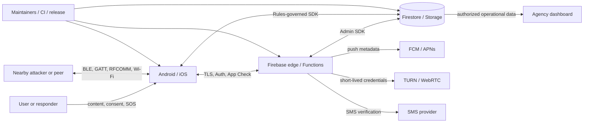

# Crisis Connect Threat Model

| Document field | Value |
|:--|:--|
| Status | Baseline threat model for security review and AFAD pilot preparation |
| System | Crisis Connect Android, iOS, Firebase Functions, Firestore/Storage, and release pipeline |
| Evidence baseline | Git commit `89ecea0d269330c8623291962738d903f707b1c8` |
| Review date | 2026-09-14 |
| Owners | Crisis Connect maintainers; security-sensitive changes require maintainer review |
| Review cadence | Before each pilot/release and after any material trust-boundary change |

This is a design-level risk analysis, not a claim that every threat below is an exploitable
vulnerability. Each threat distinguishes controls visible in the repository from work that still
needs deployment evidence, adversarial testing, or operational validation.

## Executive summary

Crisis Connect is a safety-critical, offline-first communications system. It combines untrusted
nearby radio traffic, authenticated cloud services, encrypted messaging, emergency location and
medical data, responder credentials, voice/video calls, and an optional on-device language model.
The highest-consequence failures are therefore broader than disclosure of message content: a forged
or suppressed SOS, a responder impersonation, cross-agency data exposure, or loss of service during
an incident can directly affect operational decisions.

The repository already contains substantial defense in depth. Offline payloads use authenticated
encryption; internet messaging uses Signal Protocol and an opaque relay; mobile credentials use
platform-protected stores; Firebase entry points generally combine Authentication, App Check,
validation, and Firestore Rules; responder certificates bind a role and device key after platform
attestation; nearby transports enforce bounds, freshness, deduplication, hop limits, and rate limits;
and CI includes linting, tests, CodeQL, dependency audit, native fuzzing, pinned actions, and signed
release assets. These controls are evidenced throughout the source and summarized in the existing
[security design](SECURE_DEVELOPMENT.md).

The most important residual risks for an AFAD pilot are:

1. **Emergency signal integrity and availability.** A valid app account can originate its own SOS,
   while radio jamming, device exhaustion, inaccurate location, or routing fallback can delay or
   misdirect response. Operator workflows must preserve provenance and uncertainty.
2. **Responder identity during disconnection.** A signed role certificate is deliberately usable
   offline for up to 72 hours. Revocation cannot take effect on an isolated verifier until it
   reconnects or the certificate expires.
3. **Authorization consistency across mobile, Functions, Rules, and dashboard.** Roles and agency
   identifiers are represented in custom claims and Firestore profile fields. A deployment mismatch
   or partially migrated client can produce either unintended access or emergency-path lockout.
4. **Endpoint and metadata abuse.** Contact discovery, message relay, push, TURN, presence, and call
   signaling expose relationship or availability metadata even when content is encrypted. Several
   throttles are intentionally described as best effort and need infrastructure-level quotas and
   monitoring for hostile traffic.
5. **Software and model supply chain.** The clients verify model size and SHA-256 against an
   App-Check-protected manifest, and releases are signed, but the model manifest is not independently
   signed by an offline release key. Compromise of the privileged cloud control plane can therefore
   replace both artifact and expected hash.

Before a real-data pilot, priority work is to remove production attestation bypasses, exercise
Firestore/Storage Rules in the emulator and against deployed configuration, run protocol abuse and
resource-exhaustion tests on physical devices, define measurable SOS delivery objectives and alarms,
and rehearse certificate/key revocation plus Firebase/TURN/provider outage procedures.

## Scope and assumptions

**In scope**

- Android application code, manifest, local database, platform keystore use, nearby transports,
  Signal messaging, calls, SOS, rescue features, and Crisis Sentinel under `Android/`.
- iOS application code, Keychain/Secure Enclave use, nearby transports, Signal messaging, calls,
  SOS, rescue features, and Crisis Sentinel under `iOS/`.
- Firebase Cloud Functions, Firestore Rules, Storage Rules, Authentication/App Check assumptions,
  push notifications, and third-party TURN/SMS dependencies under `Android/functions/` and
  `Android/*.rules`.
- Repository automation and release controls under `.github/workflows/`, including checked-in native
  MLS binaries consumed by the mobile applications.
- Security-relevant interaction with the Crisis Connect web dashboard where the same Firestore data,
  agency identifiers, call rooms, or operational records cross the system boundary. Dashboard
  implementation internals require their own threat model.

**Assumptions requiring owner or pilot validation**

- The target is an AFAD pilot that may process real identity, phone, precise location, medical,
  message, call, and incident data. If only synthetic data is used, privacy impact falls but integrity
  and availability requirements remain.
- Only behavior present in released mobile builds is treated as production. The repository labels
  SFU group calls with MLS media encryption as experimental and unshipped
  ([README](../README.md#L346-L353)); those paths are assessed conditionally.
- Firebase Auth, App Check, Play Integrity, App Attest, Secret Manager, Firestore, Storage, FCM/APNs,
  Cloudflare TURN, and the SMS provider are correctly configured in the deployed project. Source
  review cannot prove console policy, IAM, quota, log retention, backup, key rotation, or deployed
  rule parity.
- Mobile operating systems, hardware-backed key stores, Firebase Admin SDK, libsignal, CryptoKit,
  Google Tink, SQLCipher, WebRTC, and platform TLS validation behave according to their supported
  security contracts.
- Users can lose devices, install hostile apps, accept malicious pairing attempts, or operate while
  disconnected. A fully compromised/rooted endpoint is not expected to preserve plaintext or an
  active session, but compromise should be contained and revocable.
- BLE, Wi-Fi Direct, RFCOMM, internet, push, GPS, clocks, and third-party services can be observed,
  delayed, replayed, malformed, throttled, unavailable, or actively interfered with.

**Security objectives**

- Preserve confidentiality and authenticity of message/media content between intended endpoints.
- Preserve correctness, provenance, freshness, and availability of SOS and rescue information.
- Restrict agency operational data and privileged actions to the intended user, role, device, and
  agency scope.
- Minimize relationship, presence, location, device, and contact-discovery metadata and its lifetime.
- Make degraded or uncertain states visible; never present fallback routing, stale credentials, or AI
  output as stronger evidence than it is.
- Produce reviewable audit evidence without putting secrets or sensitive message content in logs.

**Method and limitations**

The model follows the four-question structure in the
[OWASP Threat Modeling Cheat Sheet](https://cheatsheetseries.owasp.org/cheatsheets/Threat_Modeling_Cheat_Sheet.html)
and uses the asset-centered reasoning described in
[NIST SP 800-154](https://csrc.nist.gov/pubs/sp/800/154/ipd). Control expectations are informed by
[OWASP ASVS](https://github.com/OWASP/ASVS) and
[CISA Secure by Design](https://www.cisa.gov/securebydesign). Priority is qualitative and combines
likelihood, effect on people and operations, blast radius, detectability, and recoverability. This
review is grounded in repository source at the evidence baseline; it does not include production IAM
inspection, cloud configuration export, mobile binary analysis, RF testing, or a live penetration
test.

The model must be reviewed when authentication, roles, agency routing, Firestore/Storage Rules,
message or nearby wire formats, cryptographic keys/protocols, SOS behavior, model distribution,
external providers, native binaries, release signing, or data retention changes.

## System model

### Primary components

| Component | Security role and evidence |
|:--|:--|
| Android client | Collects high-risk permissions, stores local state, performs cryptography, nearby networking, Signal messaging, calls, SOS, rescue, and AI. Backups and cleartext traffic are disabled; most components are not exported ([manifest](../Android/app/src/main/AndroidManifest.xml#L80-L166)). |
| iOS client | Provides equivalent messaging, nearby, SOS, rescue, call, AI, Keychain, and Secure Enclave paths. Cross-platform implementations and vectors are identified in the [external-interface inventory](EXTERNAL_INTERFACES.md#L63-L72). |
| Nearby communications | BLE/GATT, RFCOMM, and Wi-Fi paths accept attacker-controlled frames. Pairing uses QR ECDH or SPAKE2; the SPAKE2 flow confirms both peers before exchanging encrypted identity data ([Android pairing core](../Android/app/src/main/java/com/auralis/crisisconnect/nearby/NearbySpakePairing.kt#L11-L29)). |
| Internet messaging | Clients produce encrypted envelopes. The callable relay authenticates the caller, validates the envelope, creates messages idempotently, and assigns expiry ([relay](../Android/functions/src/messaging/relay.ts#L6-L43)); Firestore also supports direct client writes under Rules ([rules](../Android/firestore.rules#L855-L903)). |
| Firebase identity and control plane | Firebase Auth identifies accounts; App Check attests app instances; Functions perform privileged validation; Rules mediate direct database/storage access. The backend interface inventory is in [External Interfaces](EXTERNAL_INTERFACES.md#L30-L61). |
| Role-certificate service | Issues ECDSA P-256 certificates after account/role, device ownership, one-time nonce, and platform attestation checks; certificates bind owner, role, agency, device key, and expiry ([issuance](../Android/functions/src/certificates/issuance.ts#L719-L786)). |
| SOS and agency data plane | Accepts victim GPS and state, owns a signal to its first authenticated reporter, routes it to an agency panel, records route cause/history, and maintains visibility during fallback upgrades ([SOS handler](../Android/functions/src/sos/reportSignal.ts#L265-L349), [write path](../Android/functions/src/sos/reportSignal.ts#L369-L450)). |
| Voice/video and TURN | WebRTC provides DTLS-SRTP transport encryption; authenticated users can request one-hour TURN credentials from a server-side provider bridge ([TURN function](../Android/functions/src/messaging/turnCredentials.ts#L6-L84)). Media is not additionally application-layer E2EE for released 1:1 calls ([README](../README.md#L346-L352)). |
| Crisis Sentinel | Retrieves an App-Check-gated model manifest and ten-minute signed Storage URL ([model function](../Android/functions/src/crisisSentinel/modelManifest.ts#L278-L343)); clients enforce filename bounds, expected size, and optional SHA-256 before use ([Android model store](../Android/app/src/main/java/com/auralis/crisisconnect/ai/CrisisSentinelModelFileStore.kt#L9-L25), [checksum](../Android/app/src/main/java/com/auralis/crisisconnect/ai/CrisisSentinelModelFileStore.kt#L94-L140)). |
| CI and release pipeline | Builds/tests Android and Functions, runs CodeQL, npm audit, native fuzzing, Scorecard, and signs release assets. Actions are pinned by commit and jobs default to read-only permissions ([Android CI](../.github/workflows/android-ci.yml#L12-L55), [Functions CI](../.github/workflows/functions-ci.yml#L15-L51), [release signing](../.github/workflows/sign-release-assets.yml#L11-L60)). |
| External providers | Firebase/GCP, Apple/Google attestation, FCM/APNs, Cloudflare TURN, SMS, app stores, map/model hosting, and optional online AI providers are separate administrative and availability domains. |

### Data flows and trust boundaries

1. **Person ↔ mobile UI.** Users provide messages, media, contacts, QR/short codes, microphone,
   camera, sensor data, and SOS consent. The UI must distinguish identity confirmation, emergency
   status, route uncertainty, and AI advice from verified operational facts.
2. **Mobile app ↔ operating system/security hardware.** Plaintext, keys, session state, notifications,
   screenshots, clipboard, accessibility services, backups, and inter-process entry points cross a
   device boundary. Android disables backups and cleartext and limits exported components
   ([manifest](../Android/app/src/main/AndroidManifest.xml#L80-L166)); local data is described as
   SQLCipher/Keychain-backed ([README](../README.md#L324-L334)).
3. **Mobile ↔ nearby untrusted radio.** Any nearby party can advertise, connect, fragment, replay,
   corrupt, delay, or flood packets. Confidentiality begins above BLE/RFCOMM; transport discovery and
   timing remain observable. Mesh code applies payload, queue, hop, freshness, and rate bounds
   ([mesh limits](../Android/app/src/main/java/com/auralis/crisisconnect/service/gattmesh/GattMeshForegroundService.kt#L8953-L8999)).
4. **Mobile ↔ Firebase edge.** TLS terminates at the provider. Firebase Auth and App Check establish
   account/app context; Functions and Rules must independently authorize each object and action.
   Android rejects cleartext and release builds do not trust user-installed CAs
   ([network policy](../Android/app/src/main/res/xml/network_security_config.xml#L8-L32)).
5. **Functions ↔ Firestore/Storage/Secret Manager.** Admin SDK operations bypass Firestore Rules, so
   handler authorization, validation, IAM, service-account scope, secret rotation, and audit logs are
   the control boundary. Direct client SDK writes remain governed by deployed Rules.
6. **Firebase ↔ dashboard/agency operators.** Decrypted SOS and operational records become visible to
   authorized people and systems. Agency membership, least privilege, workstation/session security,
   export controls, and audit integrity govern the final confidentiality boundary.
7. **Functions/mobile ↔ external providers.** TURN, SMS, push, model storage, app stores, and optional
   AI providers receive metadata or content required for their function and can fail independently.
8. **Maintainer ↔ source/build/release.** Pull requests, workflows, dependencies, signing identities,
   cloud deployment credentials, model manifests, and checked-in native binaries can change the
   security properties of every deployed client.

#### Diagram

The arrows indicate data movement, not equal trust. Nearby peers, user-controlled input, client
devices, provider responses, and repository changes are validated at every boundary. Functions and
the dashboard are trusted to see data that the product deliberately makes server- or agency-readable,
including SOS records and operational metadata.

## Assets and security objectives

| Asset | Confidentiality | Integrity/authenticity | Availability/retention objective |
|:--|:--|:--|:--|
| Message and attachment plaintext | Only intended endpoints; agency-channel semantics may intentionally include agency members | Detect modification, identity substitution, replay, and downgrade | Deliver or queue predictably; remove relay copies after acknowledgement/expiry |
| Signal, ECDH, SPAKE2, MLS, database, and media keys | Never expose outside the minimum platform/security context | Bind keys to the correct peer, device, protocol version, and purpose | Recover through safe re-pair/rekey; never silently fall back to weaker security |
| SOS location, medical details, status, and route | Victim and authorized response personnel only | Preserve reporter, source, freshness, accuracy, route cause, ownership, and history | Emergency-priority delivery, clear degraded state, bounded duplicate handling |
| Responder identity, role, agency, and certificate | Limit personal/device metadata to operational need | Prevent forged roles, cross-agency use, stale/revoked certificate acceptance, and key substitution | Support controlled offline verification with explicit validity state |
| Account, phone/contact graph, presence, push token, and call metadata | Minimize collection, enumeration, logging, and unauthorized correlation | Bind updates to owner and intended recipient/scope | Apply deletion and expiry; allow privacy settings to take effect consistently |
| Local device database and cached media/model | Protect at rest against casual extraction and backup leakage | Detect database, media, configuration, and model tampering where feasible | Avoid corruption-induced emergency-path failure; provide safe recovery |
| Agency panels, incident records, audit logs, workflow secrets | Separate tenants/agencies and restrict secrets to server paths | Enforce least privilege, append-only evidence, attributable admin action | Retain according to incident/legal policy; support export and recovery without widening access |
| Cloud secrets and signing keys | Restrict to dedicated runtime/release identities | Prevent unauthorized certificate, TURN, SMS, model, push, or release issuance | Rotate and revoke without prolonged pilot outage |
| Mobile binaries, native libraries, model artifacts, dependencies | Public artifacts need no secrecy | Reproducible provenance, reviewed source-to-binary mapping, signed releases/models | Roll back compromised versions and notify operators/users |
| Operational telemetry and security alerts | Exclude secrets and unnecessary sensitive payloads | Time-correlated, tamper-resistant, attributable events | Alert quickly enough to protect a live incident; defined retention and ownership |

## Attacker model

### Capabilities

- An unauthenticated internet attacker can discover public endpoints, replay or mutate requests,
  automate account creation where allowed, induce provider cost, and attempt denial of service.
- An authenticated civilian can call permitted APIs, write objects allowed by Rules, choose malicious
  identifiers/content/ciphertext, create many valid messages or SOS reports for their own identities,
  and collude with other accounts.
- A nearby attacker can scan and advertise BLE services, initiate many connections, inject malformed
  frames, replay observed traffic, jam 2.4 GHz radio, manipulate timing, and present misleading
  pairing codes or social-engineering prompts.
- A malicious or compromised responder/dashboard user can exercise every permission of their role,
  export visible operational data, misuse authority-channel features, and attempt horizontal or
  cross-agency access.
- A device thief or malicious local app can observe notifications and UI, attempt deep-link/IPC abuse,
  inspect app-accessible files on a compromised device, and use live sessions until revocation,
  reauthentication, or local lockout takes effect.
- A supply-chain attacker can submit a dependency, compromise a maintainer/provider account, alter a
  workflow or manifest, replace a checked-in binary, or target build/deployment credentials.
- A compromised provider or cloud administrator can observe service metadata and may alter server-
  readable data or control-plane configuration within that provider's authority.

### Non-capabilities

- The model does not assume practical breaks of correctly implemented AES-256-GCM, SHA-256, HKDF,
  P-256, Signal Protocol, SPAKE2, MLS, DTLS-SRTP, or platform TLS.
- A passive radio observer is not assumed to know a successfully established session key or decrypt
  authenticated ciphertext merely from BLE captures.
- A normal Firebase client is not assumed to bypass correctly deployed Firestore/Storage Rules or
  the Admin SDK boundary without a separate authorization or configuration defect.
- A non-rooted remote attacker is not assumed to extract non-exportable hardware-backed private keys.
- The system cannot protect plaintext shown on, entered into, or generated by a fully compromised
  endpoint. The objective in that case is containment, detectable identity change, rekeying, and
  rapid revocation.
- Nation-state compromise of mobile OS vendors, root certificate authorities, cloud-provider control
  planes, or cryptographic primitives is outside the pilot baseline, though provider concentration
  and outage remain operational risks.

## Entry points and attack surfaces

| Surface | Attacker-controlled input | Principal risks | Current evidence |
|:--|:--|:--|:--|
| Mobile UI, QR, deep links, notifications | Text, files, QR keys/codes, URLs, route parameters, notification payloads | Social engineering, identity confusion, unsafe rendering, unintended navigation/action | External input inventory ([interfaces](EXTERNAL_INTERFACES.md#L16-L28)); Android components and URI provider ([manifest](../Android/app/src/main/AndroidManifest.xml#L108-L166)) |
| BLE/GATT/RFCOMM/Wi-Fi | Advertisements, connections, fragments, frames, clocks, peer identity claims | MITM before verification, replay, parser faults, battery/memory/radio exhaustion, topology leakage | SPAKE2 confirmation and encrypted identity ([pairing](../Android/app/src/main/java/com/auralis/crisisconnect/nearby/NearbySpakePairing.kt#L65-L142)); bounded mesh processing ([mesh](../Android/app/src/main/java/com/auralis/crisisconnect/service/gattmesh/GattMeshForegroundService.kt#L8953-L8999)) |
| Firebase callable functions | Auth/App Check tokens, structured request bodies, IDs, ciphertext, keys, GPS, device evidence | Broken object authorization, confused deputy, replay, quota/cost abuse, injection, oversized input | Function inventory ([interfaces](EXTERNAL_INTERFACES.md#L30-L51)); relay validation ([envelope](../Android/functions/src/messaging/envelope.ts#L51-L169)) |
| Direct Firestore/Storage SDK | Paths, queries, document fields, timestamps, encrypted blobs | Cross-tenant reads, forged ownership/role fields, unbounded storage, rule/query mismatch | Central role/agency helpers ([rules](../Android/firestore.rules#L4-L180)); server-only messaging key/prekey collections ([rules](../Android/firestore.rules#L797-L820)) |
| Auth, phone discovery, OTP | Phone numbers, contact batches, verification attempts, account sessions | Enumeration, SIM/account takeover, SMS pumping, privacy leakage | Non-anonymous gate ([caller-role](../Android/functions/src/certificates/callerRole.ts#L4-L40)); scan limits ([contact discovery](../Android/functions/src/messaging/contactDiscovery.ts#L14-L84)) |
| Role certificate and attestation | Device IDs, public keys, attestation chains/tokens, nonces, account role/profile | Role escalation, cloned device identity, replay, weak/dev attestation acceptance | Single-use owned nonce ([issuance](../Android/functions/src/certificates/issuance.ts#L352-L402)); issuance binding ([issuance](../Android/functions/src/certificates/issuance.ts#L719-L786)) |
| SOS ingestion and agency panels | Signal ID, status, GPS, country, battery, rescue sightings/updates | False incident, suppression, stale/false location, misrouting, unauthorized resolve/transfer | App Check, ownership, throttle, routing provenance ([SOS](../Android/functions/src/sos/reportSignal.ts#L265-L349)) |
| Message relay, push, presence | Routing metadata, ciphertext, priority, timestamps, tokens, receipts | Spam, notification amplification, graph/timing leakage, malicious ciphertext pressure | Idempotent relay/expiry ([relay](../Android/functions/src/messaging/relay.ts#L6-L43)); sender binding and bounds ([envelope](../Android/functions/src/messaging/envelope.ts#L108-L169)) |
| Calls and TURN | Bearer token, SDP/ICE, room ID, media, screen share | Credential farming, metadata leakage, call spam, media interception at endpoint/relay, resource exhaustion | Token verification and one-hour TURN TTL ([TURN](../Android/functions/src/messaging/turnCredentials.ts#L32-L84)); call encryption boundary ([README](../README.md#L346-L352)) |
| Crisis Sentinel and online AI | Prompt/context, model manifest, large model artifact, provider response/tool output | Sensitive-data disclosure, unsafe emergency advice, prompt/tool abuse, poisoned model, storage exhaustion | Short-lived allowlisted Storage downloads ([model function](../Android/functions/src/crisisSentinel/modelManifest.ts#L278-L343)); checksum checks ([model store](../Android/app/src/main/java/com/auralis/crisisconnect/ai/CrisisSentinelModelFileStore.kt#L94-L140)) |
| Build, dependencies, native binaries, release | PRs, actions, package updates, secrets, artifacts, model metadata | Malicious code/artifact, secret theft, unsigned release, source/binary mismatch | Read-only/pinned CI and tests ([CI](../.github/workflows/android-ci.yml#L12-L55)); CodeQL ([workflow](../.github/workflows/codeql.yml#L14-L50)); Sigstore bundles ([release](../.github/workflows/sign-release-assets.yml#L19-L60)) |
| Operator/admin consoles and logs | Role changes, routing config, model release config, exports, credentials | Privilege escalation, mass data access, audit tampering, accidental destructive change | Some collections are explicitly server-only and audit writes are denied to clients ([rules](../Android/firestore.rules#L967-L1027)); deployed IAM and console controls remain unverified |

## Top abuse paths

1. **Compromised responder account becomes a field credential.** An attacker steals a privileged
   account/session, registers or reuses a device record, obtains a role certificate, and presents
   valid-looking offline proofs. Attestation and one-time challenges raise the bar, but deployments
   can explicitly configure tester and demo allowlists; the demo path bypasses the entire
   device-attestation chain and must remain unset in production
   ([issuance](../Android/functions/src/certificates/issuance.ts#L56-L70)).
   Detect certificate issuance from new devices, bypass outcomes, role/agency changes, and unusual
   offline-proof volume; rehearse account, certificate, and signing-key revocation.

2. **Stolen responder device remains trusted while offline.** A thief uses an unlocked device and its
   non-exportable key to sign proofs. The server revokes the certificate, but disconnected peers
   cannot learn that fact until connectivity returns; the certificate remains acceptable until its
   72-hour expiry ([certificate design](../README.md#L297-L322)). Reduce operational validity where
   feasible, display freshness and last online revocation check, and give operators an incident-wide
   denylist distribution path over every available transport.

3. **Nearby adversary exhausts the emergency mesh.** Multiple radios advertise valid service IDs,
   churn connections, send authenticated or unauthenticated fragments, and fill queues/dedup caches,
   draining batteries and crowding out SOS or rescue traffic. Current hop, size, queue, age, and
   per-source rate limits constrain a single path, but coordinated physical-device tests must verify
   fair scheduling and emergency priority under load. Alert locally on sustained rejection and expose
   degraded mesh capacity without logging peer content.

4. **Valid account produces false or misleading SOS data.** App Check proves an app instance, not the
   truth of a location or emergency. An authenticated client can report its own signal with chosen
   location inputs; the first reporter owns that signal ID and later updates are bound to the owner
   ([SOS ownership](../Android/functions/src/sos/reportSignal.ts#L283-L307)). Operators need explicit
   source/freshness/accuracy labels, corroboration from independent rescue sightings, anomaly scoring,
   reversible triage, and a documented policy that no single client claim is treated as verified fact.

5. **Routing uncertainty sends an incident to the wrong queue.** Missing or inaccurate country input
   falls back to a shared panel. The handler records `cause`, `method`, suggestions, and history and
   preserves the prior panel when upgrading ([routing](../Android/functions/src/sos/reportSignal.ts#L309-L349),
   [history](../Android/functions/src/sos/reportSignal.ts#L369-L398)). A pilot must alarm on default
   routes, measure acknowledgement latency and misroute rate, and provide an audited human transfer
   flow with clear ownership.

6. **Cross-agency authorization drifts between layers.** A role or agency change is reflected in one
   of custom claims, `users/{uid}`, Functions, Rules, or the dashboard before the others. The result
   may be stale access or emergency data disappearing from an operator view. Use one authoritative
   role/agency lifecycle, versioned claims, forced token refresh, deny-by-default migration gates,
   emulator contract tests, deployed-rule fingerprint checks, and end-to-end canaries for each agency.

7. **Directory and communications metadata are harvested.** A phone-verified attacker distributes
   scans across accounts/devices, correlates contact matches, presence, push timing, message routes,
   and call signals. Opt-in publication, non-anonymous access, App Check, per-user delay, and a daily
   cap reduce simple scraping ([contact discovery](../Android/functions/src/messaging/contactDiscovery.ts#L7-L19),
   [limits](../Android/functions/src/messaging/contactDiscovery.ts#L32-L84)). Add project/IP/device risk
   quotas, privacy-preserving discovery evaluation, aggregate anomaly alerts, and strict metadata TTLs.

8. **Cloud relay or notification path is used for amplification.** An authenticated malicious client
   sends many bounded, valid ciphertext envelopes or creates signaling objects, increasing Firestore,
   Functions, and push cost while disturbing recipients. Message IDs are idempotent and envelopes are
   bounded, sender-bound, and expiring, but account-, recipient-, device-, IP-, and project-level rate
   budgets plus abuse response are still required. High-priority messages should not bypass quotas
   without stronger emergency authorization.

9. **TURN/call resources are farmed or calls leak metadata.** Any authenticated token can obtain
   one-hour TURN credentials; a fleet of accounts consumes relay capacity or correlates caller IP and
   timing. Apply per-UID/device/IP issuance and bandwidth quotas, provider alarms, short practical
   credential lifetimes, session binding where supported, call-spam controls, and minimal signaling
   retention. Communicate that 1:1 media has WebRTC transport encryption rather than an additional
   application E2EE layer.

10. **Model or AI control plane is poisoned.** An attacker with model-release document/Storage or
    deployment authority replaces both artifact and expected SHA-256, or an online provider receives
    sensitive incident context and returns unsafe instructions. Current allowlists, App Check, signed
    URLs, size checks, and hashes protect transport and accidental corruption, but not a compromised
    privileged publisher. Require offline-key signatures over canonical manifest+artifact digest,
    two-person promotion, provenance, rollback, high-risk-response validation, source citation, and
    strict data-minimization/consent for online processing.

11. **Release pipeline distributes altered code or native binaries.** A compromised dependency,
    maintainer, workflow, or checked-in `.so`/`.xcframework` can bypass source review. Pinning actions,
    dependency checks, CodeQL, fuzzing, and Sigstore release bundles are valuable controls. Add
    protected environments, two-person release approval, SBOM and provenance attestations, reproducible
    native builds, binary/source hash mapping, and release verification instructions in the clients.

12. **Device compromise exposes live plaintext and sessions.** Encrypted databases and key stores
    reduce at-rest extraction but cannot protect an unlocked/rooted endpoint while the app processes
    plaintext. Limit sensitive notification previews and logs, require reauthentication for privileged
    actions, use OS compromise signals as risk inputs, support remote session/device revocation, rotate
    identity/prekeys after recovery, and document that a safety-number change requires user review.

## Threat model table

Priority meanings are defined in the next section. “Residual” is the estimated risk after repository-
visible controls but before the recommended pilot controls are verified.

| ID | Threat and affected assets | Existing controls | Evidence-backed gap or uncertainty | Likelihood | Impact | Priority / residual | Recommended prevention and detection |
|:--|:--|:--|:--|:--|:--|:--|:--|
| TM-01 | Responder role impersonation through account/device provisioning | Auth, App Check, owned one-time nonce, Play Integrity/App Attest, hardware-bound key, signed certificate, audit log; tester/demo exception lists are empty by default | Explicitly configured `CC_DEMO_UIDS` entries bypass the entire attestation chain; deployed environment values remain outside repository evidence | Medium | Critical | **P0 / High** | Keep `CC_DEMO_UIDS` unset in production; prohibit debug/development attestation in pilot; alarm on bypass verdicts/new devices; two-person role assignment; test stolen-account issuance and revocation |
| TM-02 | Offline use of a revoked/stolen responder credential | Signed device-bound certificate, online status/revocation, 72-hour expiry | Offline verifier cannot obtain fresh revocation state; displayed freshness behavior needs field validation | Medium | Critical | **P0 / High** | Evaluate shorter TTL for pilot roles; show certificate age and last revocation sync; distribute signed denylist snapshots; drill device-loss containment and signer rotation |
| TM-03 | SOS forgery, false location, unauthorized resolution, or stale status | App Check, authenticated owner, signal-ID validation, GPS bounds, per-UID throttle, route history | App/device attestation does not verify that emergency/location is truthful; best-effort throttles do not stop distributed abuse | High | Critical | **P0 / High** | Multi-signal corroboration; operator provenance/freshness UI; anomaly/rate controls by UID/device/IP/project; immutable lifecycle audit; live pilot abuse playbook |
| TM-04 | SOS suppression, mesh flooding, jamming, or device-resource exhaustion | Offline and online paths, bounded packets/queues/hops/age, dedup, per-source inbound rate, retry backoff | Coordinated peers and RF jamming can bypass per-source controls; emergency traffic fairness is not established by code review | High | Critical | **P0 / High** | Physical RF/load tests; reserved SOS capacity and fair queues; watchdogs and circuit breakers; degraded-mode UI; delivery/ack SLOs and alerts; alternative transport procedure |
| TM-05 | Cross-agency or horizontal access caused by role/agency/rule drift | Auth, role helpers, profile verification, agency-bound Rules, server-only sensitive collections | Role may come from claim or Firestore; deployment parity and migration behavior are external; some staged/experimental rules intentionally have broader audiences | Medium | Critical | **P0 / High** | Single authority and version for role/agency; forced refresh/revocation; emulator matrix for every role/agency/query; deployed ruleset hash gate; cross-tenant adversarial tests and canaries |
| TM-06 | Message identity substitution, replay, downgrade, or malicious-envelope pressure | Signal/PQXDH/ratchet, TOFU/safety numbers, anti-downgrade state, AEAD, sender binding, schema/type/size/TTL validation, idempotent create | Client state loss, multi-device key changes, clock manipulation, and direct-write/callable parity require end-to-end tests | Medium | High | **P1 / Medium** | Cross-platform protocol vectors; state-loss/reinstall tests; strict replay/freshness telemetry; authenticated context/AAD review; property and malformed-ciphertext tests |
| TM-07 | Contact, presence, relationship, or call-metadata enumeration | Opt-in directory, phone-verified caller, App Check, non-anonymous gate, daily cap, owner-scoped presence settings, scoped reads | Per-UID discovery throttle is best effort; distributed accounts/IPs can correlate returned phone and profile data; retention is deployment-dependent | High | High | **P1 / High** | Transactional and infrastructure quotas; device/IP reputation; consider PSI-style discovery; minimize returned fields; metadata TTL/deletion verification; aggregate privacy-abuse alarms |
| TM-08 | Cloud messaging/push/TURN abuse and cost exhaustion | Auth/App Check on relay, bounded envelope, expiry/idempotency, bearer validation and one-hour TURN credentials, OTP guard/alarm | Authenticated fleets remain capable; TURN endpoint does not show App Check or per-user issuance quota; provider quotas/IAM are not in repo | High | High | **P1 / High** | Cloud Armor/provider quotas; UID/device/IP/recipient budgets; App Check for compatible HTTP flows; budget alerts and automated containment; provider credential rotation drill |
| TM-09 | Local plaintext/key/session exposure on lost or compromised device | SQLCipher/Keychain, Keystore/Secure Enclave, encrypted preferences/media, no Android backup, non-exported components | Rooted/jailbroken/unlocked runtime and notification/screenshot surfaces remain; reauthentication and remote wipe posture need validation | Medium | Critical | **P1 / Medium-High** | Reauth for rescue/admin/export; notification redaction; screenshot policy for sensitive screens; device/session inventory and revoke; root/jailbreak as risk signal; forensic logging without content |
| TM-10 | Attachment, media, QR, deep-link, or native parser exploitation | FileProvider not exported, bounded mesh media, native ASan fuzz target, structured validators | Full parser inventory, MIME/content verification, decompression bounds, deep-link allowlist, and all native surfaces are not proven by this model | Medium | High | **P1 / Medium** | Dedicated fuzz corpus across both platforms; content sniffing and decoded-size limits; safe viewers; deep-link negative tests; minimize native code and reproduce checked-in binaries |
| TM-11 | Crisis Sentinel model/prompt/provider compromise or unsafe emergency advice | App Check, allowed buckets/prefixes, ten-minute signed URL, safe filenames, expected size and optional SHA-256, output safety logic | Manifest and digest share the cloud trust domain; digest is optional in model type; online data flow/retention and clinical validation are not established here | Medium | Critical | **P1 / High** | Make digest mandatory; offline signature and provenance; two-person promotion; model rollback/denylist; high-risk answer constraints, citations, red-team suite; explicit online consent and DPA/retention review |
| TM-12 | CI/dependency/release/native-binary compromise | Read-only defaults, commit-pinned actions, CI tests, npm audit, CodeQL, ClusterFuzzLite, Scorecard, Sigstore bundles | Maintainer MFA, environment protection, provenance, SBOM, reproducible native builds, and mobile store release controls are outside repo evidence | Medium | Critical | **P1 / Medium-High** | Protected release environment and two-person approval; artifact attestations/SBOM; dependency policy; secretless OIDC; rebuild native artifacts from reviewed source; verify release bundle before publish |
| TM-13 | Audit-log evasion, sensitive logging, or delayed incident detection | Server-written/immutable collections in Rules; certificate and route histories; CI security results | Central alert ownership, retention, clock synchronization, PII redaction, and incident runbooks are not fully evidenced | Medium | High | **P1 / Medium-High** | Define security event schema and retention; append-only export to separate project; alerts for auth, issuance, role, routing, quota and rule changes; quarterly tabletop and evidence review |
| TM-14 | Experimental SFU/MLS room metadata leakage or room abuse if enabled | MLS treats delivery service as untrusted; room list denied; fresh room IDs; media frame E2EE design | Rules state room membership is partly capability-by-room-ID and not bound to a channel; participant/MLS relay audience is wider than the call | Medium if enabled | High | **P1 if enabled / High** | Keep disabled until room docs cryptographically and authoritatively bind channel/invite scope; migrate all clients; test unauthorized known-room access; expire rooms and roster data |

## Criticality calibration

**Impact**

| Rating | Crisis Connect meaning |
|:--|:--|
| Critical | Plausible risk to life/safety; forged or suppressed emergency action; responder/admin impersonation; cross-agency mass exposure; signing/release compromise affecting many devices |
| High | Exposure or manipulation of sensitive communications/location/medical data; sustained outage; account or device takeover; significant metadata/cost abuse |
| Medium | Limited user/scope disclosure or disruption with practical recovery and no expected safety effect |
| Low | Minor, short-lived issue with narrow scope and no sensitive-data or operational effect |

**Likelihood**

| Rating | Interpretation |
|:--|:--|
| High | Exposed to ordinary users or nearby parties, inexpensive to automate, or expected during disaster network conditions |
| Medium | Requires an authenticated account, physical proximity/device access, meaningful skill, or a control/configuration failure |
| Low | Requires multiple independent failures, rare privilege, or impractical resources for the pilot |

**Priority**

| Priority | Required disposition |
|:--|:--|
| P0 | Must be closed or formally accepted with tested compensating controls before real-data operational pilot |
| P1 | Must have an owner, target release, validation evidence, monitoring, and incident procedure before broad rollout |
| P2 | Track and address in normal hardening; verify it does not combine with a P0/P1 path |
| P3 | Documented defense-in-depth improvement or explicitly accepted limitation |

A critical impact does not automatically prove a critical vulnerability. For example, radio jamming
can critically affect availability without being preventable in software. The release decision must
record the control, detection, fallback procedure, owner, and validation evidence rather than reduce
the rating solely because the failure is operational.

**Pilot exit evidence**

- No enabled production demo/test attestation bypass; current role and agency roster reviewed.
- Deployed Firebase Rules, indexes, Storage Rules, Functions revision, App Check enforcement, IAM,
  secrets, budgets, and provider quotas match an approved, versioned deployment record.
- Cross-agency authorization matrix passes for mobile and dashboard roles; negative tests cover direct
  Firestore SDK and every privileged callable/API path.
- SOS end-to-end drill records origin, route cause, operator acknowledgement, transfers, resolution,
  disconnection/retry, fallback behavior, and recovery within approved objectives.
- Mesh abuse tests on representative phones demonstrate bounded CPU, memory, storage, battery, radio
  connections, and queue starvation while emergency traffic remains visible.
- Lost responder device, compromised account, certificate revocation, signing-key rotation, TURN/SMS
  abuse, Firebase outage, and malicious model release exercises have named owners and captured results.
- Privacy/data inventory, retention/deletion schedule, operator access review, logging redaction, and
  incident notification obligations are approved for the pilot jurisdiction and data set.

## Focus paths for security review

The following paths provide the highest-value starting set for manual review, adversarial tests, and
change-sensitive ownership. They are intentionally limited to code that implements or crosses a
security boundary.

1. `Android/functions/src/certificates/issuance.ts` — attestation policy, bypass configuration,
   single-use nonce, device ownership, certificate payload, signer, TTL, and audit.
2. `Android/functions/src/certificates/callerRole.ts`, `listing.ts`, `revocation.ts`, and
   `authorityMeshKey.ts` — authoritative role resolution, manager scope, status visibility,
   revocation, and distribution of shared authority key material.
3. `Android/firestore.rules` and `Android/storage.rules` — per-document ownership, role and agency
   isolation, query compatibility, immutable fields, server-only collections, size/retention limits,
   staged migrations, and experimental SFU rooms.
4. `Android/functions/src/sos/reportSignal.ts` plus Android/iOS SOS managers — source provenance,
   ownership, GPS/freshness validation, route fallback/upgrade, throttling, lifecycle transitions,
   retries, user consent, and operator-visible uncertainty.
5. `Android/app/src/main/java/com/auralis/crisisconnect/service/gattmesh/` and
   `iOS/Crisis Connect/Services/Connectivity/` — hostile-frame parsing, authentication order,
   replay/freshness, fragmentation, compression/decompression, rate/fairness, hop/queue limits,
   background behavior, and emergency priority.
6. Android/iOS `NearbySpakePairing` and `Spake2P256` implementations and test vectors — transcript
   construction, role binding, point validation, confirmation order, one-guess-per-session behavior,
   consent gate, identity disclosure, key erasure, and cross-platform compatibility.
7. Android/iOS Signal stores, prekey managers, message transports, safety numbers, and
   `Android/functions/src/messaging/signalPreKeys.ts` — prekey authenticity/consumption, identity
   change, multi-device state, replay/out-of-order behavior, downgrade prevention, and database reset.
8. `Android/functions/src/messaging/envelope.ts`, `relay.ts`, `messageAck.ts`, push handlers, and the
   `messages` Firestore rules — sender/recipient binding, direct-write parity, TTL, idempotency,
   notification amplification, receipts, and metadata minimization.
9. `Android/functions/src/messaging/contactDiscovery.ts`, `phoneOtp.ts`, `otpGuard.ts`, and identity
   key publication — enumeration resistance, normalization, transactional quotas, SMS pumping,
   account upgrade semantics, identifier hash strategy, returned fields, and deletion.
10. Android/iOS call signaling and `Android/functions/src/messaging/turnCredentials.ts` — call
    authorization, SDP/ICE privacy, TURN issuance/rate limits, provider credential handling, caller
    identity, screen-sharing consent, termination, and metadata expiry.
11. Android/iOS Crisis Sentinel manifest, downloader, file store, offline/online engines, and
    `Android/functions/src/crisisSentinel/modelManifest.ts` — mandatory digest, signed provenance,
    redirect/range handling, atomic commit, rollback, storage exhaustion, unsafe output, prompt/tool
    boundaries, online data minimization, and model lifecycle.
12. `Android/app/src/main/AndroidManifest.xml`, network security configuration, iOS entitlements/URL
    handling, FileProvider paths, notifications, widgets/quick actions, and exported extensions —
    least privilege, intent/deep-link validation, lock-screen exposure, backups, TLS, and IPC.
13. `.github/workflows/`, dependency lockfiles, Gradle/Xcode build logic, `.clusterfuzzlite/`, checked-in
    `liborange_mls_worker.so` files, and `OrangeMlsWorker.xcframework` — workflow token scope,
    dependency provenance, secret boundaries, native source-to-binary reproducibility, fuzz coverage,
    release signing, SBOM, and rollback.
14. Dashboard integration and shared deployment configuration — one authoritative Rules source,
    agency/role schema parity, audit API, operational exports, session/workstation protection, and
    deployed-version observability. Create a separate dashboard threat model before treating this
    boundary as fully assessed.

For every focus path, the review record should capture the exact commit/deployed revision, reviewer,
test artifact, remaining assumption, owner, and expiry date of any accepted risk. Security reports
must follow the private process in [SECURITY.md](../SECURITY.md); the threat model itself should not
contain exploit details, credentials, personal data, or live incident information.
